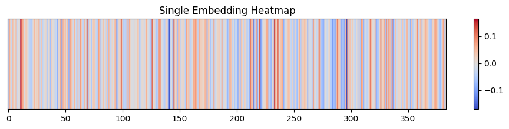
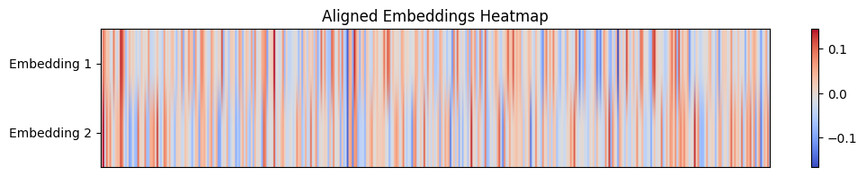
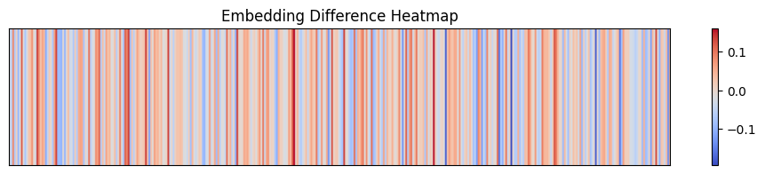

# Retrieval-Augmented Generation Proof of Concept (RAGPoC)

Resources:
- https://github.com/yanndebray/programming-GPTs (page 60)
- https://jalammar.github.io/illustrated-word2vec/


## Hello world example of RAG with local vector search

```
It was the best of times, it was the worst of times, it was the age 
of
wisdom, it was the age of foolishness, it was the epoch of belief, 
it
was the epoch of incredulity, it was the season of Light, it was the
season of Darkness, it was the spring of hope, it was the winter of
despair, we had everything before us, we had nothing before us, we 
were
all going direct to Heaven, we were all going direct the other way-
-in
short, the period was so far like the present period, that some of 
its
noisiest authorities insisted on its being received, for good or for
evil, in the superlative degree of comparison only.
```

Using sentence transformers with all-MiniLM-L6-v2, each sentence can be represented as an embedding:
```python
sentences[0], sentences[1]
```
```
(' It was the best of times',
 'it was the worst of times')
```








